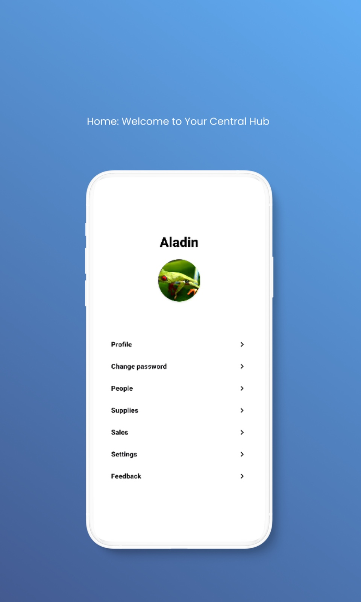

 

Gestor is an open-source app crafted to deliver personalized reports and offer greater lead management control for businesses, tailored to each client's needs. It's my interpretation and adaptation of the official [architecture](https://developer.android.com/topic/architecture) guidelines provided by Google. 

## ❗Important to know
The application is currently under development.
The following technologies are being integrated into its framework:
- Local database integration using Room.
- SharedPreferences & DataStore.
- Code obfuscation through Proguard and R8 for increased security.
- UI testing.
- Multi-platform support.

## Screenshots

  
  
  
  

## Clean architecture with 3 main modules
- Data (for API and preferences code)
- Domain (for business logic and models)
- AndroidApp (for UI logic, with MVVM)

 

## 🐛 Tests
- Unit tests
- Application tests
  - example on how to work with tests
    
## Other useful features
- This version brings [Modularization](https://developer.android.com/topic/modularization)
- Version Management (with [Version catalog](https://docs.gradle.org/current/userguide/platforms.html))
- Shared Build Logic (with [Convention plugins](https://docs.gradle.org/current/samples/sample_convention_plugins.html))
- Dependency injection (with [Hilt](http://google.github.io/hilt/))
- Network calls (with [Retrofit](https://square.github.io/retrofit/))
- Reactive programming (with [Kotlin Flows](https://kotlinlang.org/docs/reference/coroutines/flow.html))
- Android architecture components to share ViewModels during configuration changes
- [Splash Screen](https://developer.android.com/develop/ui/views/launch/splash-screen) Support
- Google [Material Design](https://material.io/blog/android-material-theme-color) library
- Declarative UI (with [Jetpack Compose](https://developer.android.com/jetpack/compose))
  - Compose Navigation (with [Hilt Support](https://developer.android.com/jetpack/compose/libraries#hilt-navigation) and Assisted Inject Example)

# Notes
- The project was also created with the purpose of demonstrating my skills in native Android development, applying industry best practices to ensure a high-quality application.
